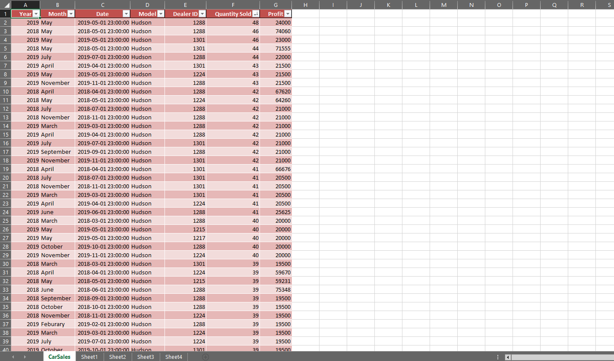
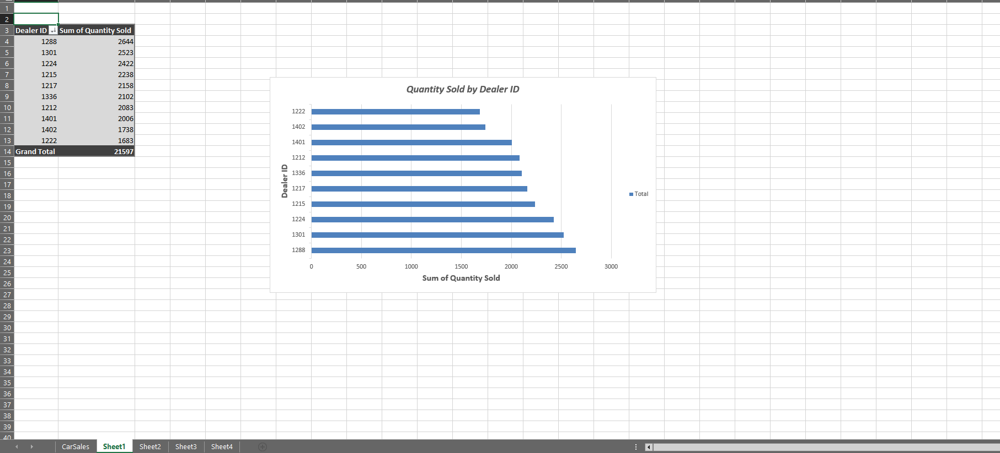
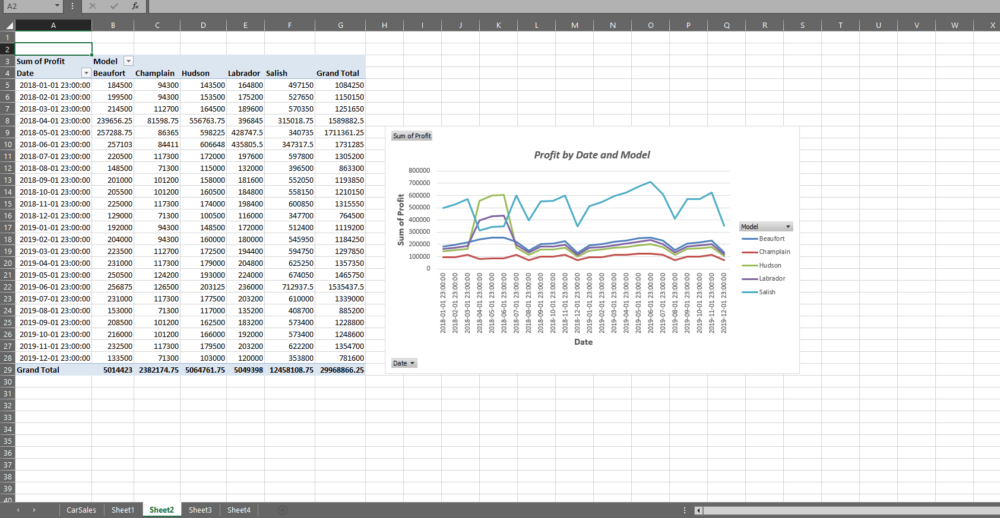
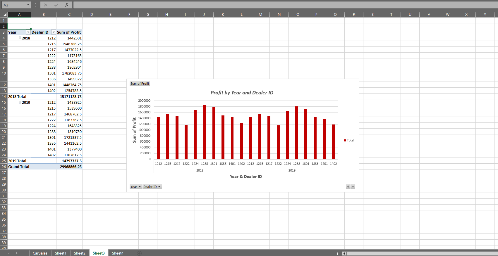
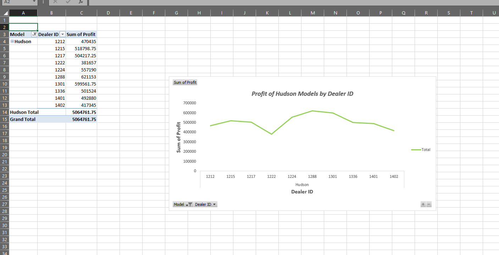
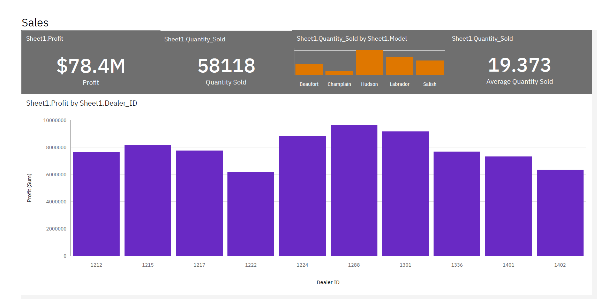
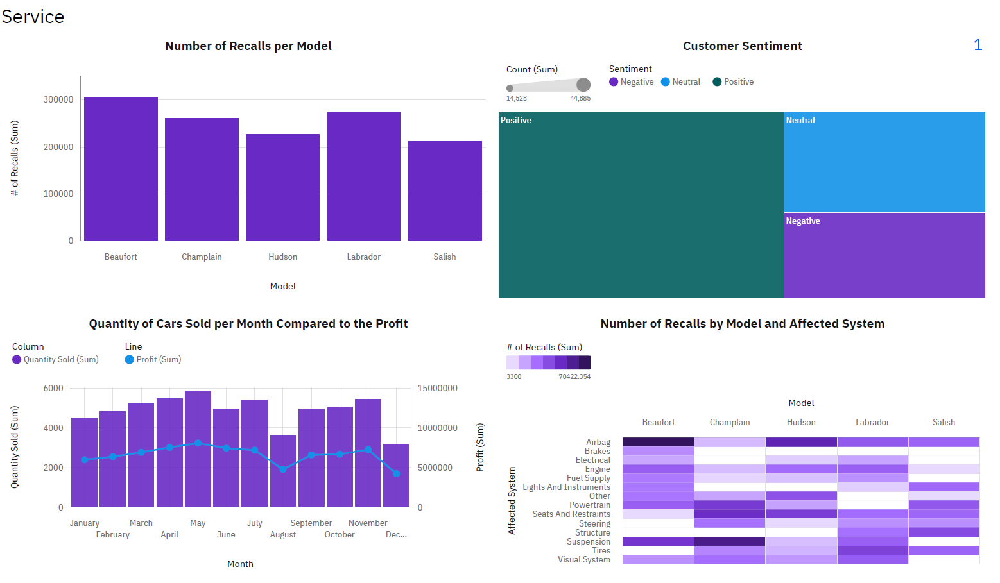

# Car Sales KPI Visualization Project

## Overview  
This project contains KPI-focused visualizations created in Excel for the Web and an interactive dashboard built in IBM Cognos Analytics. It analyzes car sales and profit trends for a regional manager overseeing multiple dealerships. The dashboards also provide insights into service quality, customer sentiment, and vehicle recalls.

---

## Tools Used  
- **Excel for the Web**  
  - Pivot Tables & Charts  
- **IBM Cognos Analytics**  
  - Interactive KPI Dashboards

---

## Data Files  
- `car_sales_by_model.xlsx` — Raw data file  
- `viz_car_sales_by_model.xlsx` — Excel workbook containing KPI visualizations  
- `dashboard_cognos_car_sales_by_model.pdf` — Exported Cognos interactive dashboard

---

## Excel Visualizations

### Raw Data Overview  
The base dataset used to create all visualizations. It includes columns such as `Dealer_ID`, `Model`, `Date`, `Profit`, and `Quantity_Sold`.

### Bar Chart – Quantity Sold by Dealer ID  
This chart shows the number of cars sold by each dealer. It helps quickly identify top-performing dealerships in terms of sales volume.

### Line Chart – Profit by Date and Model  
Displays how profit trends fluctuate over time for each car model. Useful for identifying seasonal peaks and model-specific trends.

### Column Chart – Profit by Year and Dealer ID  
Compares yearly profit across all dealers, revealing which dealerships consistently improve or decline.

### Line Chart – Profit of Hudson Models by Dealer ID  
Focused on the Hudson model, this visualization compares profit across different dealers for just this one model.

---

## Cognos Dashboard

### Sales Dashboard  
This part of the Cognos dashboard presents a snapshot of sales performance. Key performance indicators include:

- **Total Profit:** $78.4M  
- **Quantity Sold:** 58,118 units  
- **Average Quantity Sold per Sale:** 19.373

**Key visuals include:**
- **Quantity Sold by Model:** A bar chart showing that Hudson is the most sold model, followed by Labrador and Salish.
- **Profit by Dealer ID:** Visualizes dealer profitability. Dealer 1288 leads in profit, with Dealers 1301 and 1224 close behind.

### Service Dashboard  
The second page of the dashboard shifts focus to service and post-sale insights.

**Key visuals include:**
- **Number of Recalls per Model:** Shows Beaufort as the most recalled model, while Salish had the fewest.
- **Customer Sentiment Treemap:** Majority of customers report positive experiences, followed by neutral and negative sentiments.
- **Monthly Sales vs. Profit Trends:** Combined column and line chart showing both quantity sold and profit per month. Peaks are seen in May and June, with a decline in August.
- **Recalls by Model and System:** A heatmap showing which models had the most issues with specific systems such as brakes, powertrain, and suspension.

---

## How to Use  
1. Review the raw data in `car_sales_by_model.xlsx` to understand the dataset.  
2. Open `viz_car_sales_by_model.xlsx` in Excel to explore KPI visualizations and pivot tables.  
3. View the exported Cognos dashboard (`dashboard_cognos_car_sales_by_model.pdf`) to analyze sales and service KPIs in a structured, visual format.

