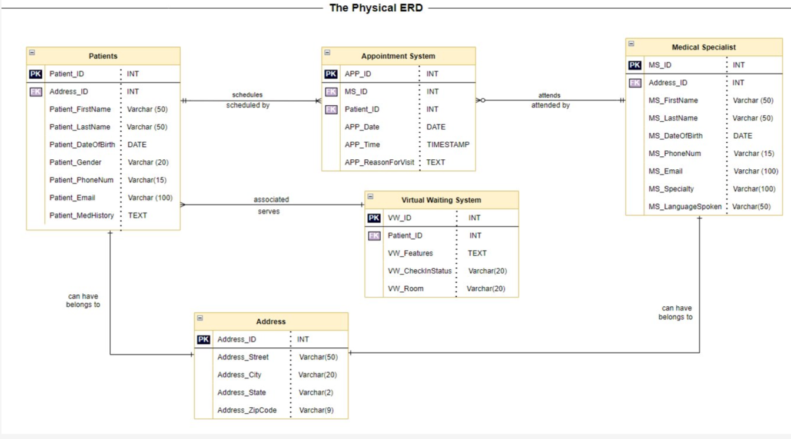
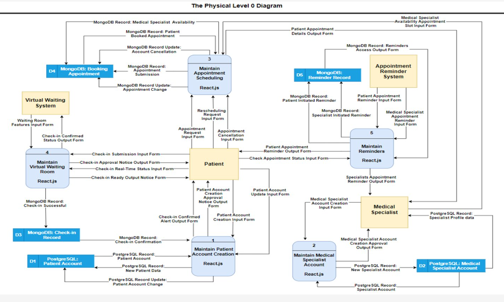
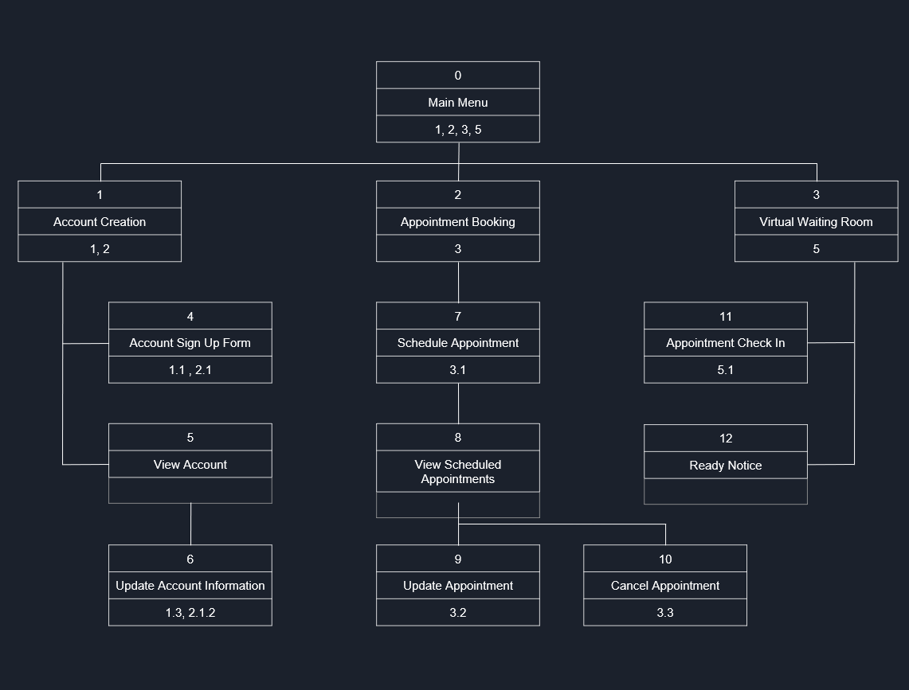

# MediSync Solutions – EMR Scheduling System

## Overview  
The **MediSync Solutions EMR Scheduling System** is designed to simplify and enhance the efficiency of appointment booking in healthcare.  
It streamlines scheduling, eliminates long wait times, and gives patients direct access to available appointments and their medical history.  
Our mission is to **empower patients and medical professionals** through technology, making healthcare more accessible, convenient, and efficient.

---

## Tools & Technologies  
- **Custom Development**
  - Patient account creation  
  - Appointment scheduling  
  - Reminder functionalities  
  - Security & compliance features  
- **Outsourced Components**
  - Virtual waiting system  
  - Additional non-core features for scalability

---

## Key Functionalities  

### For Providers
- **Insert Appointment Slot** – Add available time slots with dates and specialization.  
- **Modify Appointment Slot** – Update slots; patients notified if rescheduling is needed.  
- **Delete Appointment Slot** – Cancel slots with automated patient notifications.  
- **Appointment Reminders** – Automated 48‑hour reminders with relevant details.  
- **Insert Appointment Summary** – Document visit outcomes for future reference.  
- **Appointment Prioritization** – Automated urgency assessment for critical cases.

### For Patients
- **Create Patient Profile** – Register with personal, contact, and medical history details.  
- **Schedule Appointments** – Book with specialists, filterable by department or specialization.  
- **Appointment Cancelation** – Cancel or reschedule as needed; notify providers.  
- **Appointment Reminders** – 48‑hour notifications with time, date, and provider info.  
- **Access Medical History** – View summaries and past appointments.  
- **Virtual Waiting System** – Remote check-in, queue status, and health tips while waiting.

---

## Acquisition Strategy – Hybrid Approach  
We adopted a **Hybrid Acquisition Model**:  

- **Custom Development** – Core healthcare scheduling features  
- **Outsourcing** – Non-core functionalities (e.g., virtual waiting system)  

**Benefits:**  
- Flexibility to tailor patient-centric features  
- Risk mitigation through diversified resources  
- Cost efficiency and optimized resource allocation  
- Adaptability to evolving requirements  
- Security & compliance with healthcare regulations

---

## System Design

### Key System Diagrams  
To provide a quick visual overview of the core system architecture, here are two essential diagrams:

#### Entity Relationship Diagram (ERD)  
The ERD outlines the **database structure** for the EMR scheduling system, showing relationships between:  
- **Patients** (personal info, history)  
- **Providers** (specialization, availability)  
- **Appointments** (date, time, status, summary)  
- **Medical History** (linked to patient and appointment records)  

#### Data Flow Diagram – Level 0  
This diagram provides a **high-level view** of how data moves between external entities and the EMR system:  
- Patients request appointments, cancel, or access history  
- Providers manage slots, summaries, and prioritization  
- System sends reminders and manages queues in real-time  

*For detailed interface prototypes, acquisition strategy visuals, and additional diagrams, please refer to the respective folders.*

---

## Interface Prototypes

### Patient Portal Prototype  
- Appointment booking screen with filters by department/specialization  
- Upcoming appointments with status and cancellation/rescheduling buttons  
- Queue status with estimated wait times

### Provider Portal Prototype  
- Slot management (insert, modify, delete appointments)  
- Prioritization dashboard to identify urgent cases  
- Summary entry interface for post-appointment notes

---

## Interface Structure Design  
Focuses on **usability and clarity**:  
- Dashboard View for quick access to schedules, priorities, and reminders  
- Patient Portal for booking and history  
- Provider Portal for managing appointments and summaries  

---

## Project Reflection  
**Challenges:**  
- Large project scope (focus narrowed to scheduling module)  
- Time management in a multi-person team  
- Detailed documentation requirements  

**Lessons Learned:**  
- Value of effective communication and collaboration  
- Real-world healthcare system complexities  
- Importance of SDLC planning and iterative feedback  

---

## How to Use  
1. **Providers** log in to manage appointment availability, summaries, and priorities.  
2. **Patients** create profiles, schedule/cancel appointments, and access history.  
3. **Automated reminders** prevent missed appointments.  
4. **Virtual waiting system** enables remote check-in and real-time queue updates.

---

- Ali Akcin

